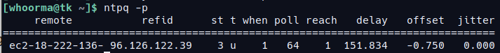
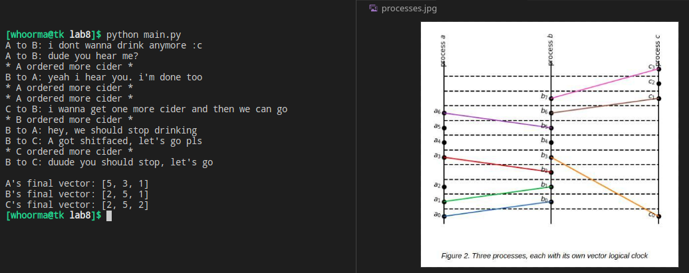

# Lab 8. Report

### Student Information

Anna Boronina (@whoorma) 

[github repository with the source code](https://github.com/annwhoorma/DS-lab-8)

### Exercise 1.2

**Q1: What is a stratum in terms of NTP?**

**A1:** Stratum is a measure of synchronization distance from the primary time source. It helps to find the most accurate time sources and to prevent time loops. There are 3 levels of stratum: 0, 1, and 2. **Stratum 0** is the most accurate one (atomic clock), but they cannot be connected to over the network. **Stratum 1** is the most accurate source of time for NTP that is available via network. Stratum 1 usually uses stratum 0 for synchronization. The next level is **stratum 2** - they are least accurate because they are synchronized with stratum 1 therefore they bring some overhead and are the least accurate. There are next levels, as I understood. The further from 0, the worse the accuracy. Also, stratum *N+1* uses stratum *N*.

### Exercise 1.3

**Q2: Provide the output of `ntpq -p` command from the client and describe the meaning of the following fields: `remote`, `refid`, `st`, `t`, `when`, `poll`, `reach`, `delay`, `offset`, and `jitter`.**

**A2:**

`remote`: NTP server we are connected to

`refid`: an opaque 32 bit identifier for the selected upstream peer of the peer - refers to the NTP servers that the remote servers are connected to

`st`: stratum level

`t`: the type that the server is using: unicast, multicast, broadcast, manycast. It is unicast in our case

`when`: how long ago since the last time the server was polled

`poll`: how often the server is polled (usually it's set to 64 seconds)

`reach`: result of the most recent 8 NTP updates (set to *377* (octal system) if all 8 were successful - not the case for us - i honestly don't know why it shows *1*)

`delay`: delay in reaching the server

`offset`: difference between the local clock and the server's clock

 `jitter`: network latency 

### Exercise 2

**Q3: What are the lacks of using the Lamport’s algorithm?**

**A3**: The algorithm has a few disadvantages:

- Failure of one process may bring the progress down - vectors that interacted with a failed process will not be properly updated 
- If we have *N* processes, then the algorithm's complexity is *3*(N-1)* messages per event, since we have 3 types of messages: *request* (send a message), *reply* (receive a message) and *release* (imitate event).

### Assignment

You can see the output of the program below and compare it to the picture.

